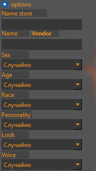

# *D&D Master support*
___
## Текущее состояние проекта:
Версия: 0.2 alfa  
Скачать можно в моём [телеграм канале](https://t.me/project_amari)
___
## Оглавление
+ [Предисловие](#preface)
+ [Главный экран(Меню)](#main_screen)
+ [Трекер. Добавление персонажа(Tracker)](#tracker.add_char)
+ [Трекер(Tracker)](#tracker.tracker)
+ [Окно инициативы(Initiative)](#initiative)
+ [Сценарий(Scenario)](#scenario)
+ [Записи(Notes)](#notes)
+ [Музыка(Music changer)](#music)
+ [Правила(Rules)](#rules)
+ [Просмотр изображений(Image view)](#img)
+ [Генератор магазина(Generate store)](#generate_store)
+ [Генератор НПС(NPC generator)](#generate_npc)
+ [Генераторы(Generators)](#to_many_generators)
+ [Горячие клавиши](#shortcut)
___

## Предисловие
Приложение DMS это мой учебный проект, созданый с целью облегчить мастерам dnd проведение их игр.  
При помощи этого приложения вы сможете:
+ Отслеживать  хп, кд, инициативу а также слоты заклинаний игроков
+ Быстро расчитывать инициативу в боевой сцене
+ Создавать пресеты с противниками
+ Писать сценарий и заметки
+ Включать музыку
+ Список правил под рукой
+ Показывать картинки
+ Генерировать магзин
+ Генерировать НПС
+ А так же случайные энкаутеры, механики боссов и тд
___

## Главный экран
Пустой экран дабы ваши игроки не смогли подсмотреть что же это у вас там такое в сценарии!
### Главное меню 
Меню можно открыть нажав на иконку в верхнем левом углу приложения(Красная стрелка на фото)

Здесь распологается меню  
  
>Сохранение  
Загрузка  
Загрузка последней сессии  
(**Последней сессией считается сессия, в которой был создан хотя бы один персонаж**)  
Открытие окна генераторов энкаунтеров и тд  
Окно с информацией  
### Меню
Меню можно раскрыть дабы увидеть названия вкладок. Сделать это можно по клику на верхний элемент списка

Меню можно скрыть по повторному нажатию на верхний элемент меню либо по некоторым пустым пространствам
---

## Трекер Создание персонажа

Заполняется как в примере.  
**Поля *Hp*, *Ac* а так же *Spell slot* должны состоять только из цифр!**  
**Максимальное количество персонажей на данный момент 4!**  
После создания персонажей поставте галочку напротив *Creation off* что бы перейти в сам трекер
---

## Трекер

+ ### 1
    Кнопка открытия окна расчёта инициативы
+ ### 2
    Здесь можно бросить кубик указав, количество кубиков, количество граней кубика, и добавив модификатор.  
    При включений галочке *advantage* программа выведет два значения, что бы вы могли выбрать большее или меньшее.  
+ ### 3
    Удаление персонажа
+ ### 4
    При включеной галочке *lock initiative* в трекере заблокируется возможность изменить
    инициативу персонажу, аналогично для *lock armor class* 
+ ### 5
    Собственно само окно трекера.  
    При нажатии на HP персонажа вылезет окно  
      
    > Плюс: Добавить HP  
    Минус: Отнять HP  
    Крестик: закрыть окно  
    Set: максимальное HP равняется введённому числу  
    Возвращение: Текущее HP равняется максимальному

    При нажатой галочке *hide* напротив надписи *Spell slot* слоты заклинаний исчезнут а на их место
    встанет инициатива и увеличеное окно для заметок.  
    Кнопка *Restore slot* восстановит количество слотов до исходного  
    Кнопка *Set* установит максимальное значение слотов на текущее
___

## Окно инициативы
  
При нажатии галочек *option* и *preset* раскроются соответсвующие части меню
 
+ ### 1
  Инициатива игроков
+ ### 2
  Добавление опонентов и расчёт инициативы
+ ### 3
  Пресеты противников  
  
В 1 части вы можете прописать инициативу которая выпала у игроков с куба, либо нажать на значёк кубика
и инициатива рассчитается случайно  
  
В 2 части вы можете добавить опонентов нажав кнопочку плюс  
Появится окно добавление опонентов  
  
Здесь вы можете вписать имя опонента, **модификатор** инициативы, количество HP опонента а также
выбрать количество добавляемых опонентов.  
*В примере будет создано 5 противников с Именем Test enemy, инициативой +2, HP равным 50*  
  
В начале пишется модификатор инициативы противника  
После инициативы пишется имя портивника. если противников создаётся несколько, они автоматически
пронумеровываются от 1 до количества противников  
Последним идёт HP противника  
  
Что бы удалить опонента выберите его из списка и нажмите минус  
Что бы отчистить список нажмите крестик  

Для рассчёта инициативы нажмите значёк кубика  
  
Инициатива игрока будет взята из части 1 окна инициативы  
Инициативы противников расчитана случайно с учётом модификатора.  
  
Вы можете выбрав противника нажать на кнопку с гаечным ключом. 
Это откроет окно редакции противника  
  
Здесь вы можете вписать число на которое хотите изменить значение HP противника
Где плюс добавить а минус отнять HP  
Set сделает HP равным введённому  
Крестик закроет окно  
*Если хп противника опустится до 0 или ниже он автоматически будет удалён из списка инициативы* 
  
При изменении значения HP игрока значение перенесётся в трекер после закрытия окна инициативы  
**Игрок не пропадает из списка инициативы при HP равном 0 или ниже**
  
В 3 части окна инициативы вы можете создать пресеты опонентов  
Настоятельно рекомендуется создавать пресет до расчёта инициативы, 
так как в пресете сохранится **текущее состояние HP опонентов** и **не сохранятся игроки**  
  
Что бы создать пресет вам надо добавить противников в части 2 и начажать плюсик в части 3  
Появится окно создания пресета, где вам требуется вписать имя пресета после чего нажать плюс  
  
После чего он появится в списке пресетов  
*В примере была дано имя Test preset*  
  
Для загрузки пресета выберите его из спика и нажмите стрелочку рядом с плюсом  
Для удаления пресета нажмите минус  
___

## Сценарий  
  
Здесь вам требуется ввести название для записи в окно в левом верхнем углу и нажать кнопку *add*  
После чего запись будет добавлена в выпадающий список в верхнем правом углу
*В примере была создана запись Test chapter*  
После чего вы можете вводить текст в большое поле по центру. Текст сохранится в выбраной записи.
  
В нижней части окна есть голочка *tag notes* при нажатии на которую формат записей сменится на формат
вложений  
  
При нажатии на кнопку *Add* вы сможете добавить категорию  
  
После чего нажмите *ok*  
После этого категория появится в списке  
  
Что бы зайти в категорию нажмите на неё. Когда вы находитесь в категории первым в списке у вас появляется
пункт *...* при нажатии на который вы вернётесь к выбору категорий.  
  
При нажатии кнопки *Add* находясь в категории вы добавите запись в категорию  
  
Непосредственно к записи в категории может быть добавлен текст аналогично записям в начале  
> Мною как мастером это используется следующим образом. В записях я пишу сюжет по главам. 
> А в разделе *tags notes* я записываю описания мест, городов, статы и способности врагов и прочее
___

## Записи
  
Четыре независимых поля для записи
> Мною как мастером это используется следующим образом. Здесь я описываю персонажей игроков и 
> оставляю записи о героях которые мне могут потребоваться в дальнейшем  
___

## Музыка  
  
В поле *Category name* введите имя для категории  
В поле *Scene name* введите название сцены  
В поле *URL music* введите ссылку  
После чего нажмите кнопку *set*  
В одну категорию вы можете добавить любое количество сцен по очереди  
В одну сцену вы можете добавить любое количество ссылок по очереди  
Выберите категорию в ней сцену после чего нажмите *open* для открытия ссылок в выбраной сцене  
*delete* для удаления выбраной сцены или категории  
> Мною как мастером это используется следующим образом. Здесь я включаю музыку во время игры.
> В категориях я обычно вписываю локацию а в сцену конкретное место, закряпляя за ними ссылки на youtube.
> Вы можете использовать ссылки на любые ресурсы но youtube открывает музыку сразу, а за счёт
> небольшой задержке между открытиями окон, можно наслаивать друг на друга несколько треков
___

## Правила  
  
Здесь вы можете посмотреть некоторые правила dnd 5e (правила взяты с сайта dnd.su)  
В выпадающем меню сверху вы можете найти разные правила  
___

## Просмотр изображений  
  
Для просмотра изображения откройте окно просмотра кнопкой *open view*  
Кнопкой *Open* вы можете открыть изображение  
*Оно откроется в окне просмотра*  
Изображения должны быть в формате png jpeg  
Если вы хотите что бы файлы были отсортированы то пронумеруйте их самостоятельно  
*Название должно начинаться с цифры, далее должен идти пробел, точка, нижнее подчёркивание либо сразу название*
как показано в примере выше  
___

## Генератор магазина  
  
Здесь вы можете сгенерировать магазин.  
Выберите кажество магазины и его типа из списков в центре и нажмите *Generate*  
  
Сгенерируется магазин перед вами будет информация о продавце а справа будет ассортимент  
В окошке в левой части вы можете добавить своё описание магазину  
Если вы нажмёте на галочку *options* вы сможете настроить генерируемую таверну  
  
Если вы оставите поле имени магазина пустым оно будет задано по формату store Имя продавца  
Если вы оставите после имени продавца пустым оно будет сгенерировано случайно
___

## Генератор NPC  
  
Если вы оставите после имени пустым оно будет сгенерировано случайно  
Справа вы можете оставить заметки для каждого NPC  
___

## Генераторы  
  
Что бы открыть генераторы кликните по соответсвующему пункту *Главного меню*  
Выберите из списка интересующий вас пункт и нажмите *Random* что бы получить случайный пункт 
либо *Open all* что бы просмотреть весь список  
___

## Горячие клавиши  
CTRL+L Главный экран  
CTRL+0 Главный экран  
CTRL+1 Трекер  
CTRL+I Окно инициативы  
CTRL+2 Сценарий  
CTRL+3 Записи  
CTRL+4 Музыка  
CTRL+5 Правила  
CTRL+6 Просмотр изображение  
CTRL+V Открыть окно просмотра изображений  
CTRL+7 Генератор магазина  
CTRL+8 Генератор NPC  
CTRL+left Предыдущее изображение в окне росмотра изображений    
CTRL+right Следующее изображение в окне росмотра изображений  

