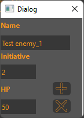
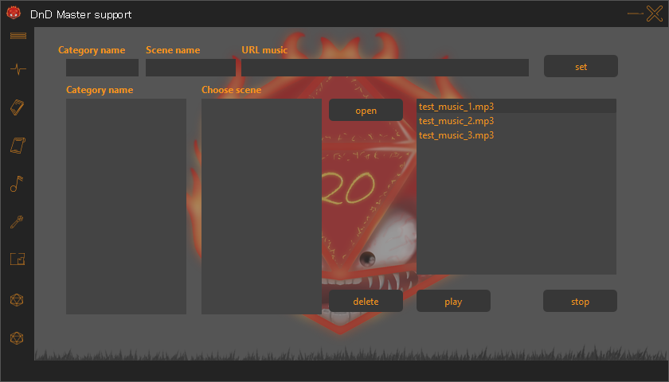
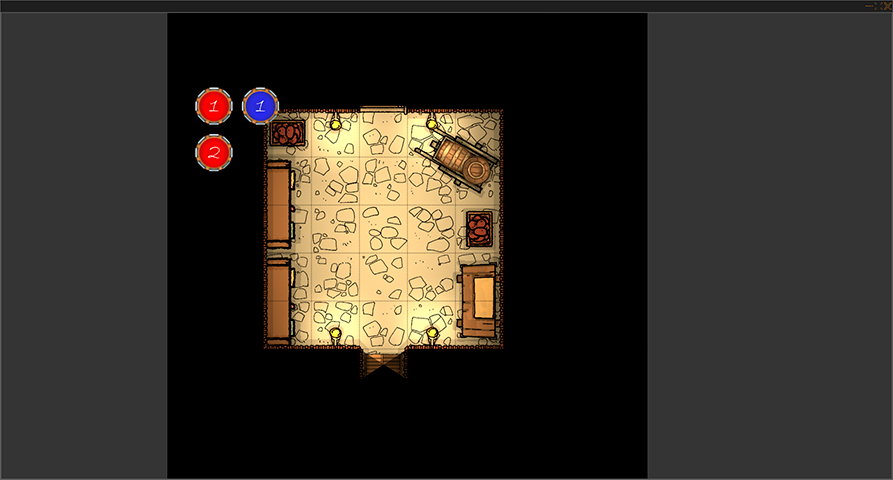

# *D&D Master support* #
___
## Текущее состояние проекта: ##
Версия: 0.0.4 alfa  
Скачать можно в моём [телеграм канале](https://t.me/project_amari)
___
## Оглавление ##
+ [Предисловие](#preface)
+ [Главный экран(Меню)](#main_screen)
+ [Трекер. Добавление персонажа(Tracker)](#tracker.add_char) 
+ [Трекер(Tracker)](#tracker.tracker)
+ [Окно инициативы(Initiative)](#initiative)
+ [Сценарий(Scenario)](#scenario) 
+ [Записи(Notes)](#notes)
+ [Музыка(Music changer)](#music)
+ [Правила(Rules)](#rules)
+ [Просмотр изображений(Image view)](#img)
+ [Генератор магазина(Generate store)](#generate_store)
+ [Генератор НПС(NPC generator)](#generate_npc)
+ [Генераторы(Generators)](#to_many_generators)
+ [Горячие клавиши](#shortcut)
___

## Предисловие ##
Приложение DMS - это мой учебный проект, созданный с целью облегчить мастерам dnd проведение их игр.  
При помощи этого приложения вы сможете:
+ Отслеживать хп, кд, инициативу, а также слоты заклинаний игроков
+ Подсчитывать хп игроков и противников
+ Быстро рассчитывать инициативу в боевой сцене
+ Создавать пресеты с противниками
+ Писать сценарий и заметки
+ Включать музыку
+ Иметь список правил под рукой
+ Показывать картинки
+ Генерировать магазин
+ Генерировать НПС
+ А так же случайные энкаунтеры, механики боссов и тд
___

## Главный экран ##
Пустой экран, что бы ваши игроки не смогли подсмотреть, что же это у вас там такое в сценарии!  
Главный экран можно открыть [горячей клавишей](#shortcut)
### Главное меню ### 
Меню можно открыть нажав на иконку в верхнем левом углу приложения(Красная стрелка на фото)

Здесь располагается меню  
  
>Сохранение  
Загрузка  
Загрузка последней сессии  
(**Последней сессией считается сессия, в которой был создан хотя бы один персонаж**)  
Открытие окна генераторов, энкаунтеров и тд  
Окно с информацией  
### Меню ###
Меню можно раскрыть, что бы увидеть названия вкладок. Сделать это можно по клику на верхний элемент списка
  
  
Меню можно скрыть по повторному нажатию на верхний элемент меню, либо по некоторым пустым пространствам
---

## Трекер. Создание персонажа ##
  
  
Заполняется как в примере.  
**Поля *Hp*, *Ac* а так же *Spell slot* должны состоять только из цифр!**  
**Максимальное количество персонажей на данный момент 4!**  
После создания персонажей поставьте галочку напротив *Creation off*, что бы перейти в сам трекер
---

## Трекер ##  
   
  
+ ### 1 ###
    Кнопка открытия окна расчёта инициативы
+ ### 2 ###
    Здесь можно бросить кубик, указав количество кубиков, количество граней кубика и добавив модификатор.  
    При включении галочки *advantage* программа выведет два значения, что бы вы могли выбрать большее или меньшее.  
+ ### 3 ###
    Удаление персонажа
+ ### 4 ###
    При включенной галочке *lock initiative* в трекере заблокируется возможность изменить
    инициативу персонажу, аналогично для *lock armor class* 
+ ### 5 ###
    Окно трекера.  
    При нажатии на HP персонажа вылезет окно  
      
    > Плюс: Добавить HP  
    Минус: Отнять HP  
    Крестик: закрыть окно  
    Set: максимальное HP приравняется введённому числу  
    Возвращение: Текущее HP равняется максимальному

    При нажатой галочке *hide* напротив надписи *Spell slot* слоты заклинаний исчезнут, а на их место
    встанет инициатива и увеличенное окно для заметок.  
    Кнопка *Restore slot* восстановит количество слотов до исходного  
    Кнопка *Set* установит максимальное значение слотов на текущее
___

## Окно инициативы ##
  
При нажатии галочек *option* и *preset* раскроются соответствующие части меню
  
+ ### 1 ###
  Инициатива игроков
+ ### 2 ###
  Добавление оппонентов и расчёт инициативы
+ ### 3 ###
  Пресеты противников  
  
В 1 части вы можете прописать инициативу, которая выпала у игроков с куба, либо нажать на значок кубика
и инициатива рассчитается случайно  
  
В 2 части вы можете добавить оппонентов нажав кнопочку плюс  
Появится окно добавление оппонентов  
  
Здесь вы можете вписать имя оппонента, **модификатор** инициативы, количество HP оппонента, а также
выбрать количество добавляемых оппонентов.  
*В примере будет создано 5 противников с Именем Test enemy, инициативой +2, HP равным 50*  
  
В начале пишется модификатор инициативы противника  
После инициативы пишется имя противника. Если противников создаётся несколько, они автоматически
пронумеровываются от 1 до заданного количества противников  
Последним идёт HP противника  
  
Что бы удалить оппонента выберите его из списка и нажмите минус  
Что бы очистить список нажмите крестик  
Что бы отредактировать противника выберите его из списка и нажмите кнопку с гаечным ключом  
   
после редактирования нажмите плюс, что бы изменения вступили в силу

Для расчета инициативы нажмите значок кубика  
  
Инициатива игрока будет взята из части 1 окна инициативы  
Инициатива противников рассчитана случайно с учётом модификатора.  
  
После расчёта инициативы вы можете выбрав противника нажать на кнопку с гаечным ключом. 
Это откроет окно редакции противника, но уже с редакцией только HP противника  
   
Здесь вы можете изменить значение HP противника, добавив(+) или отняв(-) нужное количество
HP  
Set сделает HP равным введённому значению  
Крестик закроет окно  
*Если хп противника опустится до 0 или ниже, он автоматически будет удалён из списка инициативы* 
  
При изменении значения HP игрока значение перенесётся в трекер после закрытия окна инициативы  
**Игрок не пропадает из списка инициативы при HP равном 0 или ниже**
  
В 3 части окна инициативы вы можете создать пресеты оппонентов  
Настоятельно рекомендуется создавать пресет до расчёта инициативы, 
так как в пресете сохранится **текущее состояние HP оппонентов** и **не сохранятся игроки**  
**А загрузка пресета сбросит расчёт инициативы**  
  
Что бы создать пресет, вам надо добавить противников в части 2 и нажать плюсик в части 3  
Появится окно создания пресета, где вам требуется вписать имя пресета, после чего нажать плюс  
  
Он появится в списке пресетов  
*В примере было дано имя Test preset*  
  
Для загрузки пресета выберите его из списка и нажмите стрелочку рядом с плюсом  
Для удаления пресета нажмите минус  
___

## Сценарий ## 
  
  
Здесь вы можете записать сценарий по главам.  
Что бы добавить главу, введите название в поле в верхнем левом углу и нажмите кнопку *add*  
После этого вы можете вводить текст для главы. Текст сохранится в выбранной главе
  
В нижней части окна есть галочка *tag notes*, при нажатии на которую формат сценария сменится на формат
заметок по категориям  
  
При нажатии на кнопку *Add* вы сможете добавить категорию  
  
Введите название категории, после чего нажмите *ok*  
Категория появится в списке  
  
Что бы зайти в категорию, нажмите на неё. Когда вы находитесь в категории, первым в списке у вас появляется
пункт "*...*", при нажатии на который вы вернётесь к выбору категорий.  
  
При нажатии кнопки *Add* находясь в категории вы добавите запись в категорию  
  
Введите название записи и нажмите *ok*  
Выбрав запись в списке слева вы можете ввести для неё текст в правой части окна  
> Мною, как мастером, это используется следующим образом. В записях я пишу сюжет по главам.  
> В разделе *tags notes* я записываю описания мест, городов, статы, способности врагов и прочее.  
> К примеру я создаю категорию противники и в ней создаю запись с конкретным противником, в эти записи 
> я записываю статы и способности.
___

## Записи ##
  
  
Четыре независимых поля для записи
> Мною, как мастером, это используется следующим образом. Здесь я описываю персонажей игроков и 
> оставляю записи о героях, которые мне могут потребоваться в дальнейшем  
___

## Музыка ##  
  
  
В поле *Category name* введите имя для категории  
В поле *Scene name* введите название сцены  
В поле *URL music* введите ссылку  
После чего нажмите кнопку применить (*set*)  
В одну категорию вы можете добавить любое количество сцен по очереди  
>Для этого вам требуется ввести название уже существующей категории и новое название сцены  

В одну сцену вы можете добавить любое количество ссылок по очереди
>Для этого вам требуется ввести название уже существующей категории и существующей сцены,
> после этого ввести новую ссылку, она добавится к старой, уже сохранённой, 
> либо вы можете ввести сразу несколько ссылок через пробел.

Выберите категорию, в ней сцену, после чего нажмите *open* для открытия ссылок в выбранной сцене  
Если в сцене несколько ссылок они откроются по очереди  
*delete* для удаления выбранной сцены или категории  
> Мною, как мастером, это используется следующим образом. Здесь я включаю музыку во время игры.
> В категориях я обычно вписываю локацию, а в сцену конкретное место, закрепляя за ними ссылки на youtube.
> Вы можете использовать ссылки на любые ресурсы, но youtube открывает музыку сразу, а за счёт
> небольшой задержки между открытиями окон, можно наслаивать друг на друга несколько треков
___

## Правила ##  
  
  
Здесь вы можете посмотреть некоторые правила dnd 5e (правила взяты с сайта dnd.su)  
В выпадающем меню сверху вы можете найти разные правила  
___

## Просмотр изображений ##  
  
  
Что бы просмотреть изображение, вам требуется предварительно поместить его в папку images  
Изображение должно быть в формате: png, jpeg  
Если вы добавили изображение, в папку images, после запуска программы, то нажмите обновить 
    
Для открытия окна просмотра нажмите *Open view*
  
Изначально это окно пустое, что бы открыть изображение выберите его из списка в основном окне приложения
и нажмите *Open*  
Кнопка *left* переключит изображение на предыдущее в списке  
Кнопка *right* переключит изображение на следующее в списке  
Для того что бы разместить токены на изображении, укажите нужное количество в правой части основного окна.  
Где *Enemy token* это красные токены(противники), а *Hero token* это синие токены(герои).  
После чего нажмите *Open*  
*В примере выбран один синий токен и два красных,  
а изображение создано при помощи программы [Dungeondraft](https://dungeondraft.net/)*  
  
В основном окне программы вы можете настроить размер токенов.  
Кнопкой *Reduce token* уменьшить  
Кнопкой *Increase token* увеличить  
**Изменение размеров токенов сбрасывает их позицию, так же как и открытие нового изображения!**  
  
Вы можете перетаскивать токены!  
  
___

## Генератор магазина ##  
  
  
Здесь вы можете сгенерировать магазин.  
Выберите качество магазина и его тип из списков в центре. Нажмите *Generate*  
  
Сгенерируется магазин, который будет отображаться в выпадающем списке в верхней левой части окна.
Там же вы сможете переключаться между созданными магазинами.  
Перед вами будет информация о продавце, а справа будет ассортимент  
В окошке в левой части вы можете добавить своё описание магазину  
Описание закрепляется за выбранным магазином  
Если вы нажмёте на галочку *options*, вы сможете настроить генерируемую таверну  
  
Если вы оставите поле имени магазина пустым, оно будет задано по формату "store имя продавца"  
Если вы оставите поле имени продавца пустым, оно будет сгенерировано случайно
___

## Генератор NPC ##  
  
  
Если вы оставите поле имени пустым, оно будет сгенерировано случайно  
В выпадающем списке по центру вы сможете переключаться между NPC  
Справа вы можете оставить заметки для каждого NPC  
___

## Генераторы ##  
  
  
Что бы открыть генераторы кликните по соответствующему пункту [**Главного меню**](#main_screen)  
Выберите из списка интересующий вас пункт и нажмите *Random*, что бы получить случайный пункт, 
либо *Open all*, что бы просмотреть весь список  
___

## Горячие клавиши ##  
CTRL + L Главный экран  
CTRL + 0 Главный экран  
CTRL + 1 Трекер  
CTRL + i Окно инициативы  
CTRL + 2 Сценарий  
CTRL + 3 Записи  
CTRL + 4 Музыка  
CTRL + 5 Правила  
CTRL + 6 Просмотр изображений  
CTRL + V Открыть окно просмотра изображений  
CTRL + 7 Генератор магазина  
CTRL + 8 Генератор NPC  
CTRL + left Предыдущее изображение, в окне просмотра изображений    
CTRL + right Следующее изображение, в окне просмотра изображений  

